# Домашнє завдання до Теми 4. DML та DDL команди. Складні SQL вирази

## 1. Створіть базу даних для керування бібліотекою книг згідно зі структурою, наведеною нижче. Використовуйте DDL-команди для створення необхідних таблиць та їх зв'язків.

Текст SQL коду у файлі p1.sql.

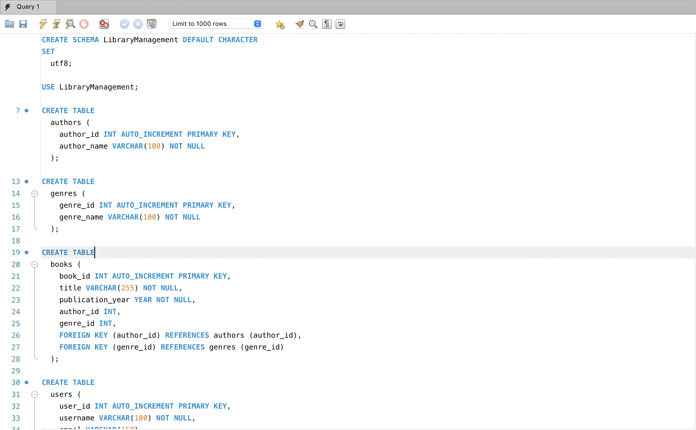
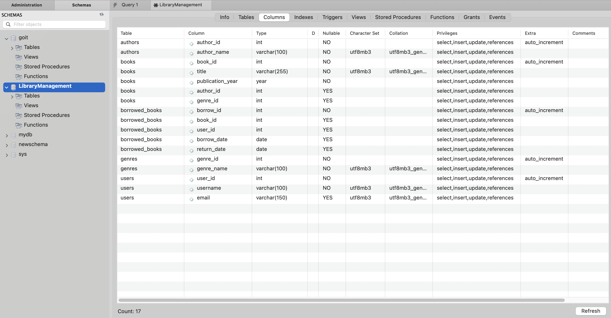

## 2. Заповніть таблиці простими видуманими тестовими даними. Достатньо одного-двох рядків у кожну таблицю.

Текст SQL коду у файлі p2.sql.

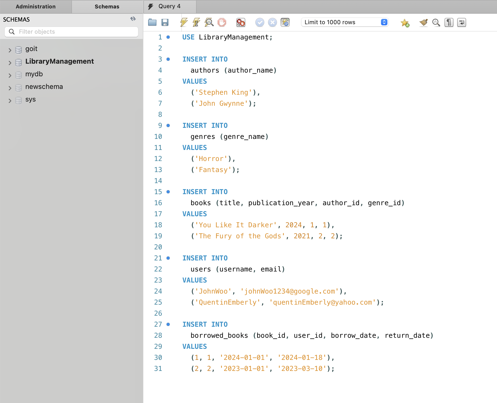
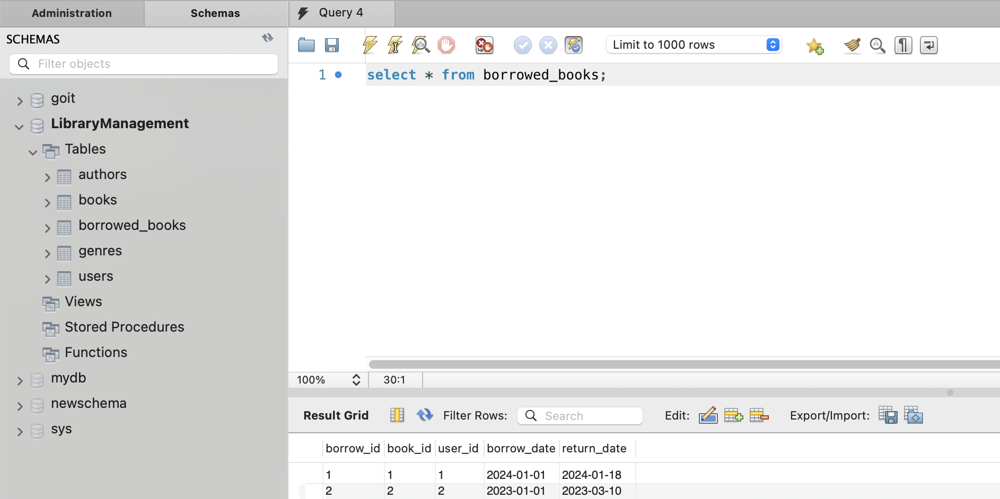

## 3. Перейдіть до бази даних, з якою працювали у темі 3. Напишіть запит за допомогою операторів FROM та INNER JOIN, що об’єднує всі таблиці даних, які ми завантажили з файлів: order_details, orders, customers, products, categories, employees, shippers, suppliers. Для цього ви маєте знайти спільні ключі. Перевірте правильність виконання запиту.

Текст SQL коду у файлі p3.sql.

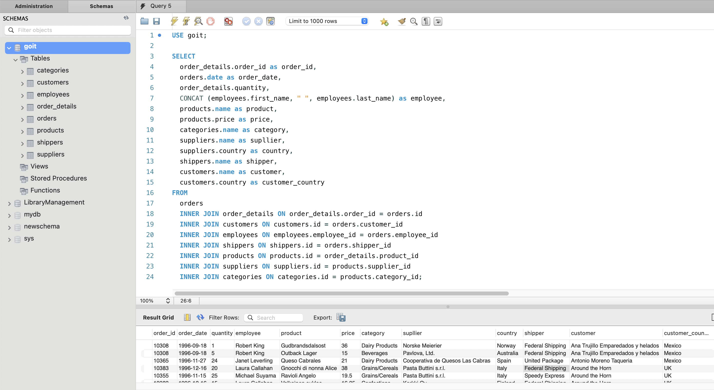

## 4. Виконайте запити, перелічені нижче.

### 4.1 Визначте, скільки рядків ви отримали (за допомогою оператора COUNT).

Текст SQL коду у файлі p4_1.sql.

Отримано 518 рядків.

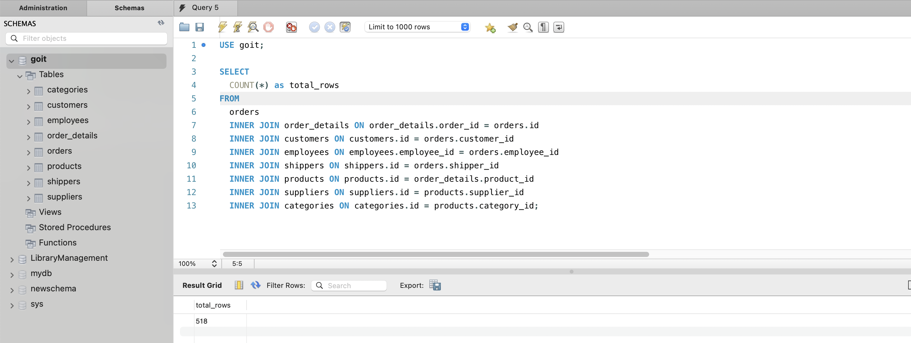

### 4.2 Змініть декілька операторів INNER на LEFT чи RIGHT. Визначте, що відбувається з кількістю рядків. Чому? Напишіть відповідь у текстовому файлі.

Текст SQL коду у файлі p4_2.sql.

Отримано 518 рядків.

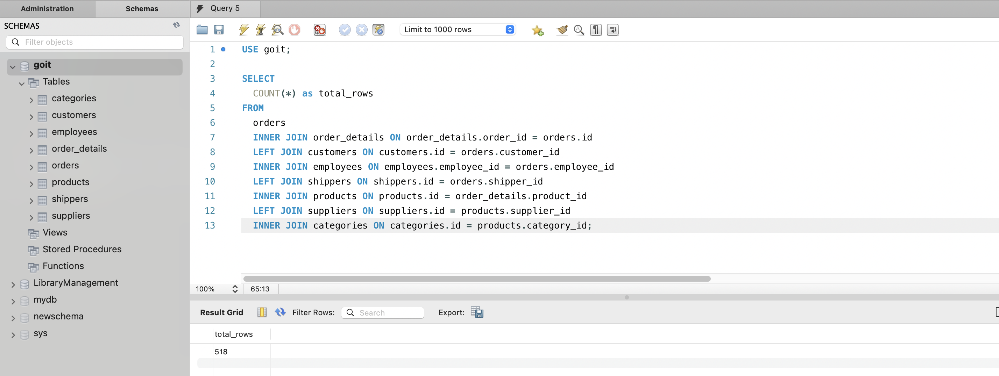

### 4.3 Оберіть тільки ті рядки, де employee_id > 3 та ≤ 10.

Текст SQL коду у файлі p4_3.sql.

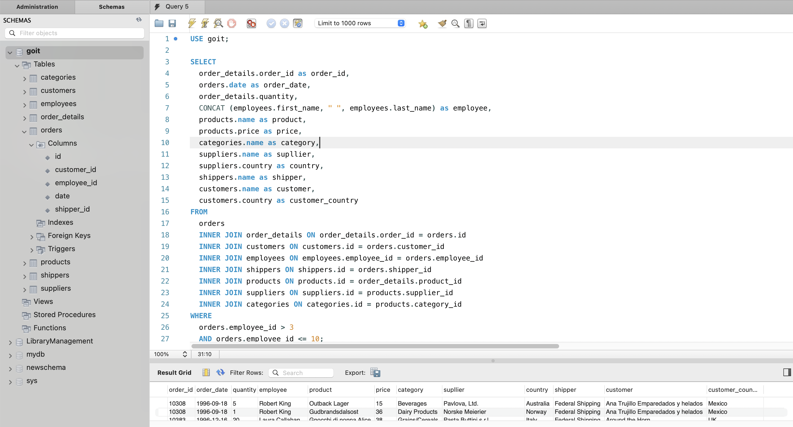

### 4.4 Згрупуйте за іменем категорії, порахуйте кількість рядків у групі, середню кількість товару (кількість товару знаходиться в order_details.quantity)

Текст SQL коду у файлі p4_4.sql.

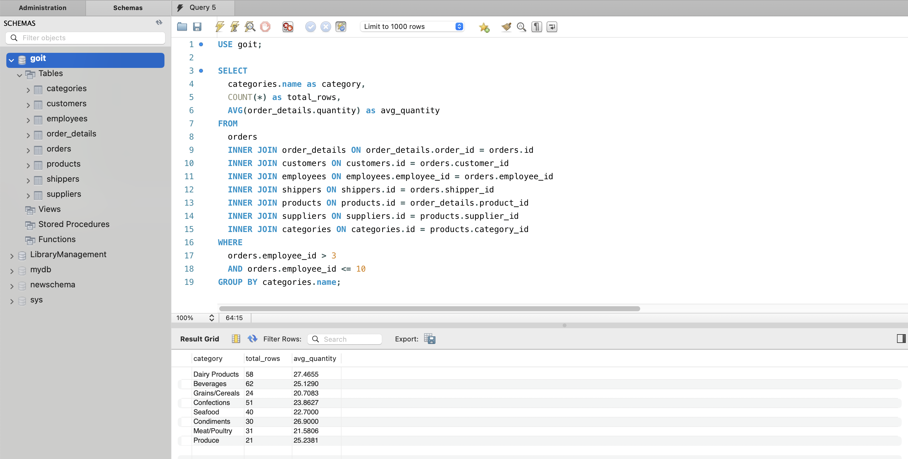

### 4.5 Відфільтруйте рядки, де середня кількість товару більша за 21.

Текст SQL коду у файлі p4_5.sql.

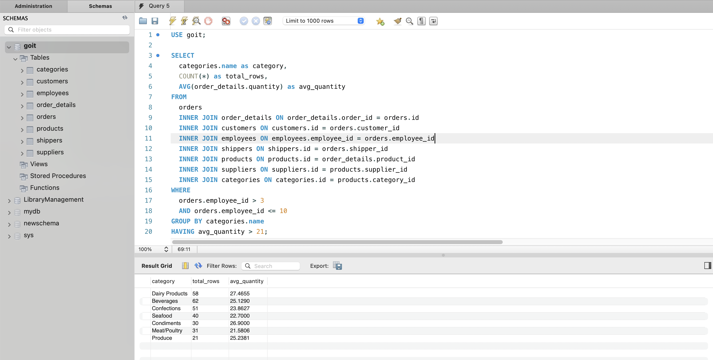

### 4.6 Відсортуйте рядки за спаданням кількості рядків.

Текст SQL коду у файлі p4_6.sql.

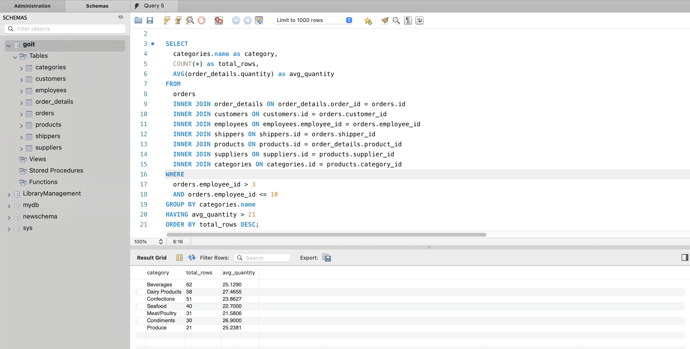

### 4.7 Виведіть на екран (оберіть) чотири рядки з пропущеним першим рядком.

Текст SQL коду у файлі p4_7.sql.

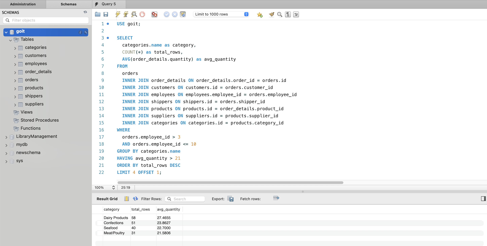
